# YAChatGPT

Standing for "Yet Another ChatGPT Frontend," this project stemmed from a personal desire to gain more granularity in interacting with ChatGPT. Not just content with the conventional user-interface available on the OpenAI website, the aim was to offer users the ability to view detailed prompts and responses. Moreover, the aspiration was to create an environment where users could leverage template prompts, potentially simplifying repeated interactions and laying the groundwork for future user-friendly features. The initiative provided a perfect playground to experiment with the latest web technologies - from diving deep into the functionalities of Next.js 13 to tapping into the power of Firebase. The journey was equally intriguing, considering it involved acquainting oneself with a gamut of unfamiliar libraries, making it not just a software development task but also a steep and enriching learning curve.

## Description

### Key Features:

- Seamless Sign-In: Quickly sign in with your Google account.
- Conversations On-The-Go: Initiate new chat sessions effortlessly.
- Pick Your Chat Partner: Choose your desired ChatGPT model.
- Dynamic Template Prompts: Create and integrate template prompts, utilizing the {{text}} placeholder for real-time text integration.
- Real-time Sync: Update and manage prompt details, instantly mirrored on Firebase.
- Custom Conversational Experience: Dive into advanced settings; fine-tune ChatGPT responses by adjusting parameters like temperature, topP, frequency penalty, and more.
- Text streaming of responses

### Technologies Used:

- Next.js 13 & TypeScript: Provided a solid foundation for building a performant, type-safe, server-side rendered application.
- TailwindCSS: Allowed for rapid, utility-first styling, ensuring the application looks snazzy without compromising speed.
- Firebase: A choice for real-time data handling and authentication. Even though it was a new terrain for me, its scalability and real-time capabilities justified the learning curve.
- SWR: Ensured data-fetching was smooth and efficient, particularly useful given the chat's dynamic nature.
- NextAuth: Streamlined the authentication process, particularly integrating with Google accounts.
- OpenAI API: The bedrock for the ChatGPT functionality, allowing those intriguing machine-human convos.

### Challenges & Looking Forward:

Initially, Firebase threw me for a loop. Being a PaaS I hadn't ventured into before, there were initial hurdles, a few tutorials, and moments of doubt. But now, I feel I've not only grappled with it but genuinely leveraged its potential. As for the horizon? I'm already brainstorming features to further enhance the user experience and provide even more customizable chat dynamics.

I intend to implement these other features over time:

- [x] Change to using streamed responses from OpenAI
- [ ] Support Import and Export options for both Conversations and Prompts
- [ ] Implementing search in both Conversations and Prompts
- [ ] Create checkpoints in conversations where you can return to and try something else
- [ ] Add voice input
- [ ] Global shortcuts

## Screenshots

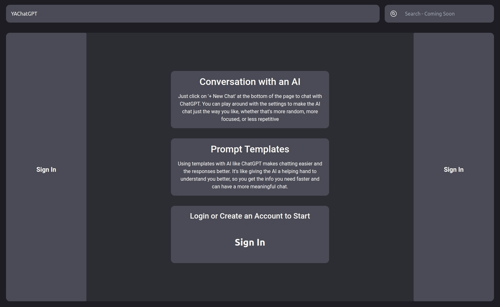
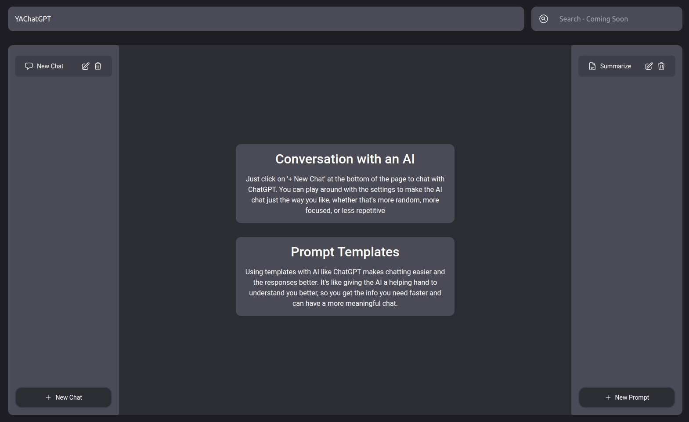
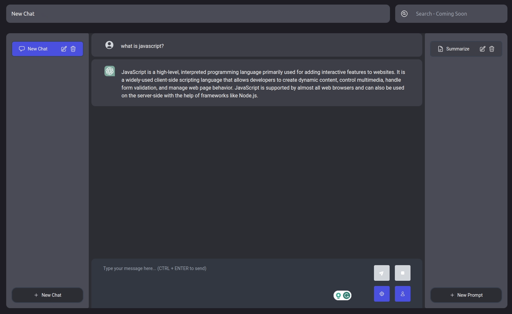

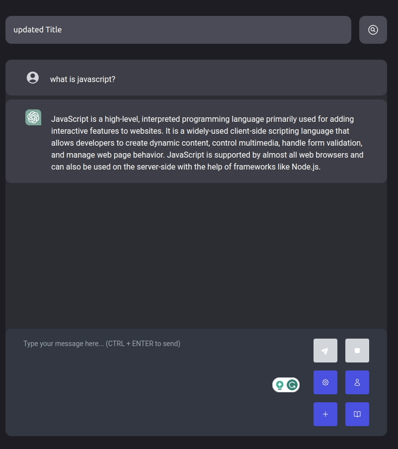
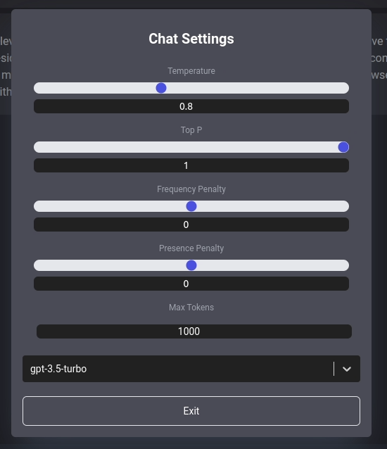
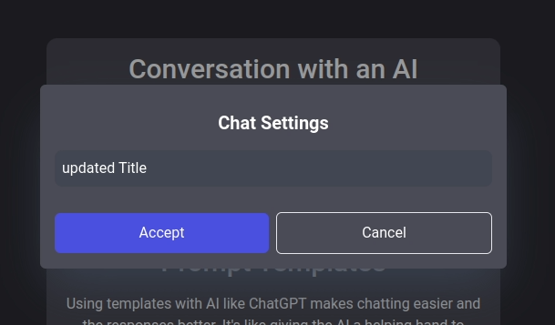
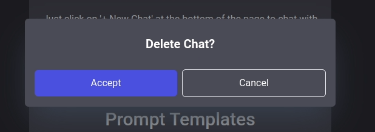
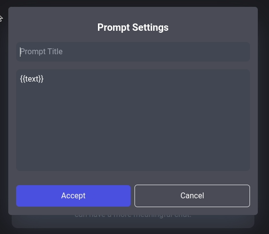
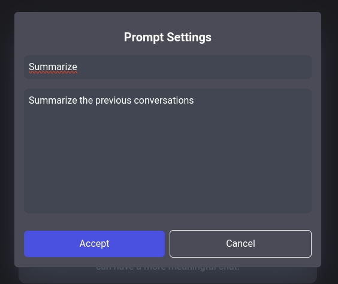
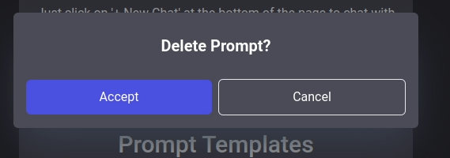
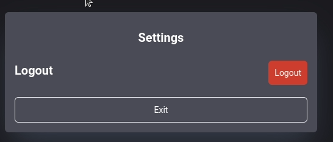

## How to Install and Run

### Install

1. Clone the repository: `git clone https://github.com/KBMaglalang/YAChatGPT`
2. Navigate to the project directory: `cd YAChatGPT`
3. Install the necessary packages: `npm install` or `npm i`
4. Copy the `.env.example` file. You can create either `.env.local` or `.env` based on your preference
5. Open the newly created .env or .env.local file and populate the fields with the required values. Ensure the necessary permissions are granted for any services or APIs you're connecting to.
6. Replace the configuration details in firebase.ts with your specific Firebase configuration information

### Run

1. Run `npm run dev`
2. Click on the link shown in the terminal, usually `localhost:3000`
3. Sign in and create an account by clicking on the center icon
